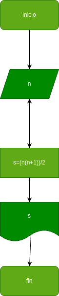

# Suma_n_Numeros
suma de los n primeros numeros naturales

# analisis

## input 
 

 ### variables de entrada
 n: numero para sumar los numeros anteriores a el
 ### prosesisng
 s:
 s=(n(n+1))/2

 ### output
 s
 # diseño

 
 # construccion